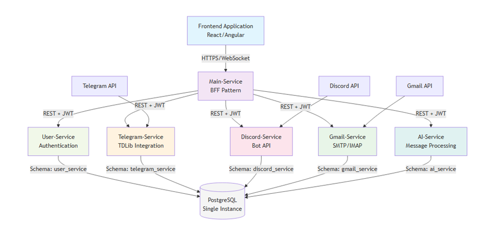

# Criteria

## Criterion: Backend Architecture & Implementation

### Architecture Decision Record

#### Status

**Status:** Accepted

**Date:** 2025-12-11

#### Context

The platform requires centralized management of multiple communication channels (Telegram, Gmail, Discord) with AI personalization. Key challenges include independent service scaling, secure credential management, and seamless integration with external APIs while maintaining SOLID principles and multi-layer architecture.

#### Decision

Implemented microservices architecture using Spring Boot 3.x with 6 independent services: User (auth), Main (BFF), Telegram, Discord, Gmail, and AI. Each service uses PostgreSQL with separate schemas, Flyway migrations, JWT authentication, and Swagger documentation. Services communicate via REST APIs with centralized exception handling and structured logging.

#### Alternatives Considered

| Alternative | Pros | Cons | Why Not Chosen |
|-------------|------|------|----------------|
| Monolithic Spring Boot | Simpler deployment, single codebase | Poor scalability, tight coupling, single point of failure | Cannot scale services independently |
| Node.js microservices | Async I/O, JavaScript ecosystem | Less strict typing, different tech stack requirement | Project requires Java-based stack |
| ASP.NET Core | Strong typing, Microsoft ecosystem | Different language, less familiar | Java expertise and requirement |

#### Consequences

**Positive:**
- Independent service scaling and deployment
- Clear separation of concerns per communication platform
- Technology flexibility for future integrations
- Simplified debugging and testing per service

**Negative:**
- Increased deployment complexity (6 services)
- Inter-service communication overhead
- Distributed transaction challenges

### Implementation Details

#### Key Implementation Decisions

| Decision | Rationale |
|----------|-----------|
| Spring Boot 3.x with Java 17 | Modern framework with excellent ecosystem, production-ready features |
| PostgreSQL with separate schemas | Data isolation per service, transactional integrity, schema versioning |
| JWT with access/refresh tokens | Stateless authentication, scalable across services, standard approach |
| Flyway for migrations | Version-controlled DB changes, repeatable deployments |
| Swagger/OpenAPI | Comprehensive API documentation, testing interface |

#### Project Structure

```
communication-platform/
├── user-service/          # Authentication & authorization
├── main-service/          # BFF orchestration layer
├── telegram-service/      # Telegram TDLib integration
├── discord-service/       # Discord JDA bot management
├── gmail-service/         # Gmail OAuth2 & API
├── ai-service/            # OpenAI personalization
└── database-init/         # PostgreSQL initialization
```

*Figure 1 — Detailed Architecture diagram*

### Requirements Checklist

| # | Requirement | Status | Evidence/Notes |
|---|-------------|--------|----------------|
| 1 | Modern framework (Spring Boot) | + | Spring Boot 3.x across all services |
| 2 | Database with state management | + | PostgreSQL 16 with separate schemas |
| 3 | ORM usage | + | Spring Data JPA/Hibernate |
| 4 | Multi-layer architecture | + | Controller/Service/Repository layers |
| 5 | SOLID principles | + | Dependency injection, interface segregation |
| 6 | API documentation | + | Swagger/OpenAPI 3.0 per service |
| 7 | Global error handling | + | GlobalExceptionHandler in each service |
| 8 | Logging implementation | + | SLF4J with Logback |
| 9 | Production deployment | + | Docker Compose orchestration |
| 10 | Test coverage (70%+ business logic) | + | JUnit 5, Mockito, integration tests |

### Known Limitations

| Limitation | Impact | Potential Solution |
|------------|--------|-------------------|
| Synchronous service communication | Latency in broadcast operations | Implement message queue (RabbitMQ/Kafka) |
| No distributed tracing | Difficult to track requests across services | Add correlation IDs and tracing tools |
| Manual secret management | Security risk in configuration | Implement HashiCorp Vault or AWS Secrets Manager |

### References

- [Spring Boot Documentation](https://spring.io/projects/spring-boot)
- [PostgreSQL 16 Documentation](https://www.postgresql.org/docs/16/)
- [OpenAPI Specification](https://swagger.io/specification/)
- API Documentation: `/api_docs/` directory