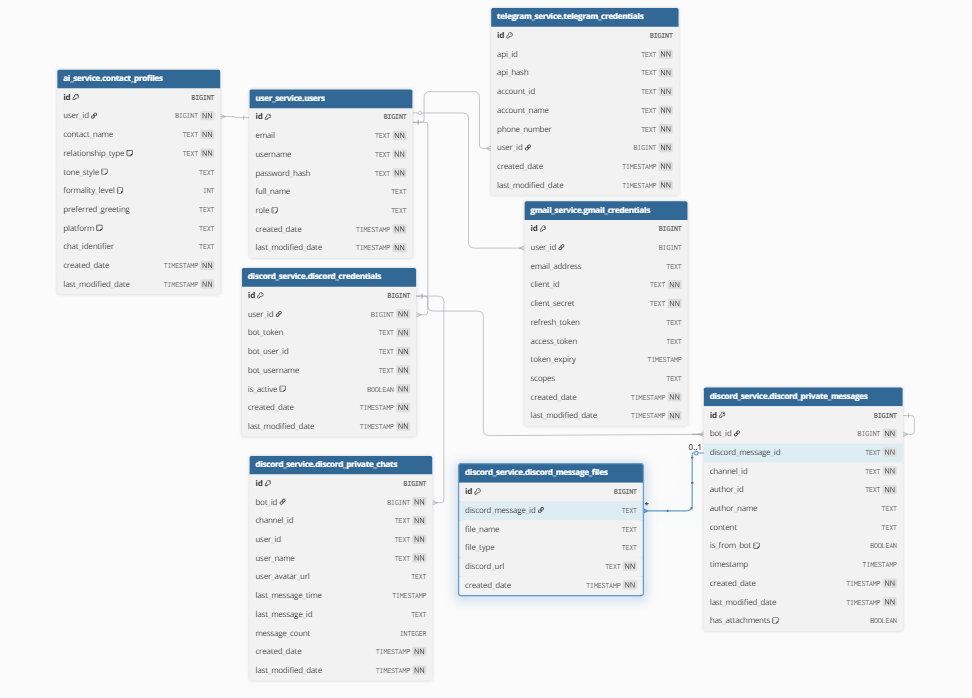

## Criterion: Database Architecture & Data Management

### Architecture Decision Record

#### Status

**Status:** Accepted

**Date:** 2025-12-05

#### Context

Microservices architecture requires data isolation while maintaining referential integrity and operational simplicity. Challenge: balance service autonomy with data consistency, enable independent schema evolution, enforce cross-service relationships, and minimize infrastructure complexity without sacrificing scalability or maintainability.

#### Decision

Implemented **single PostgreSQL 16 instance with multiple schemas** (user_service, telegram_service, discord_service, gmail_service, ai_service). Each microservice manages its own schema with Flyway migrations. Role-based access (app_admin, app_user) prevents superuser usage. All tables normalized to 3NF with primary keys, foreign keys, CHECK constraints, and indexes on FK columns.

#### Alternatives Considered

| Alternative | Pros | Cons | Why Not Chosen |
|-------------|------|------|----------------|
| Separate DB per service | True data isolation, independent scaling | Complex cross-service queries, operational overhead, multiple backups | Over-engineered for current scale |
| Shared single schema | Simple implementation, easy queries | Poor service boundaries, coupling, migration conflicts | Violates microservice principles |
| NoSQL (MongoDB, DynamoDB) | Schema flexibility, horizontal scaling | No ACID guarantees, complex relationships, migration difficulty | Transactional integrity required |

#### Consequences

**Positive:**
- Clear service ownership with logical schema boundaries
- Simplified operations (single backup, monitoring, connection pool)
- Enforced referential integrity across services via FK constraints
- Independent schema evolution through service-specific Flyway migrations
- Strong ACID guarantees for transactional consistency

**Negative:**
- Single database becomes potential bottleneck at large scale
- Schema-level isolation weaker than separate databases
- Risk of cross-schema coupling if not carefully managed

### Implementation Details

#### Key Implementation Decisions

| Decision | Rationale |
|----------|-----------|
| PostgreSQL 16 as RDBMS | Mature ecosystem, JSONB support, robust constraints, transaction support |
| Schema-per-service pattern | Logical isolation without operational overhead of multiple DBs |
| Flyway for migrations | Version-controlled schema evolution, repeatable deployments |
| Indexes on all FK columns | Optimize join performance for cross-service queries |
| CHECK constraints for enums | Enforce valid values at database level (role, platform, direction, type) |
| app_user role for runtime | Restricted permissions prevent privilege escalation |

#### Database Structure

```
PostgreSQL Instance
├── user_service/
│   └── users (PK: id, UK: email, username)
├── telegram_service/
│   └── telegram_credentials (FK: user_id → users.id)
├── discord_service/
│   ├── discord_credentials (FK: user_id → users.id)
│   ├── discord_private_messages (FK: bot_id, UK:(bot_id,discord_message_id))
|   ├── discord_private_chats (FK: bot_id, UK:(bot_id, user_id), (bot_id, channel_id)) 
│   └── discord_message_files (FK: message_id)
├── gmail_service/
│   └── gmail_credentials (FK: user_id → users.id)
└── ai_service/
    └── contact_profiles (FK: user_id → users.id)
```

#### ER Diagram


### Requirements Checklist

| # | Requirement | Status | Evidence/Notes |
|---|-------------|--------|----------------|
| 1 | Modern RDBMS with ACID support | + | PostgreSQL 16 with full transactional guarantees |
| 2 | Normalization to 3NF | + | All tables properly normalized, no redundancy |
| 3 | Primary/foreign keys defined | + | PKs on all tables, FKs for all relationships |
| 4 | Constraints (NOT NULL, UNIQUE, CHECK) | + | Applied across schemas for data integrity |
| 5 | Role-based access control | + | app_admin, app_user roles; no superuser usage |
| 6 | Password encryption (BCrypt) | + | Hashed with modern algorithm in password_hash column |
| 7 | SQL migrations in version control | + | Flyway migrations per service in Git |
| 8 | Indexes for optimization | + | All FK columns indexed for join performance |
| 9 | Data integrity enforcement | + | FK constraints with CASCADE, CHECK constraints |
| 10 | Data dictionary documentation | + | Complete schema docs in database_doc.md |

### Known Limitations

| Limitation | Impact | Potential Solution |
|------------|--------|-------------------|
| Single DB instance | Bottleneck at very high scale | Migrate to separate DBs per service with eventual consistency |
| No stored procedures/triggers | Business logic in application layer | Implement critical validations as DB functions if needed |
| No read replicas | Read-heavy loads impact write performance | Add PostgreSQL streaming replication for read scaling |

### References

- [PostgreSQL 16 Documentation](https://www.postgresql.org/docs/16/)
- Database Documentation: [database_doc.md](database_doc.md)
- Flyway Migrations: `*/src/main/resources/db/migration/`
- Database Init Scripts: [database-init/01-init.sql](../../../database-init/01-init.sql)